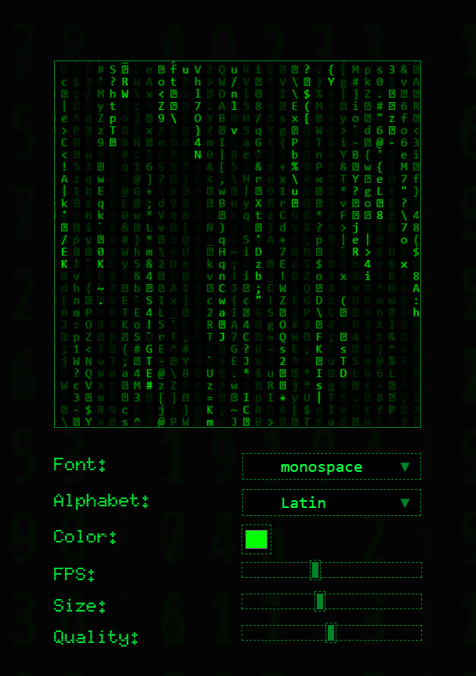

## Rodando localmente

Clone o projeto

```bash
  git clone https://github.com/ThiagoBkS/matrix-alghorithm

```

Entre no diretório do projeto

```bash
  cd matrix-alghorithm
```

Rode o comando para buildar o projeto

```bash
  npm run build
```

Abra o arquivo index.html no seu navegador ou instale a extensão [Live Server](https://marketplace.visualstudio.com/items?itemName=ritwickdey.LiveServer) no VSCode.

## Stack utilizada

HTML, CSS, JavaScript
